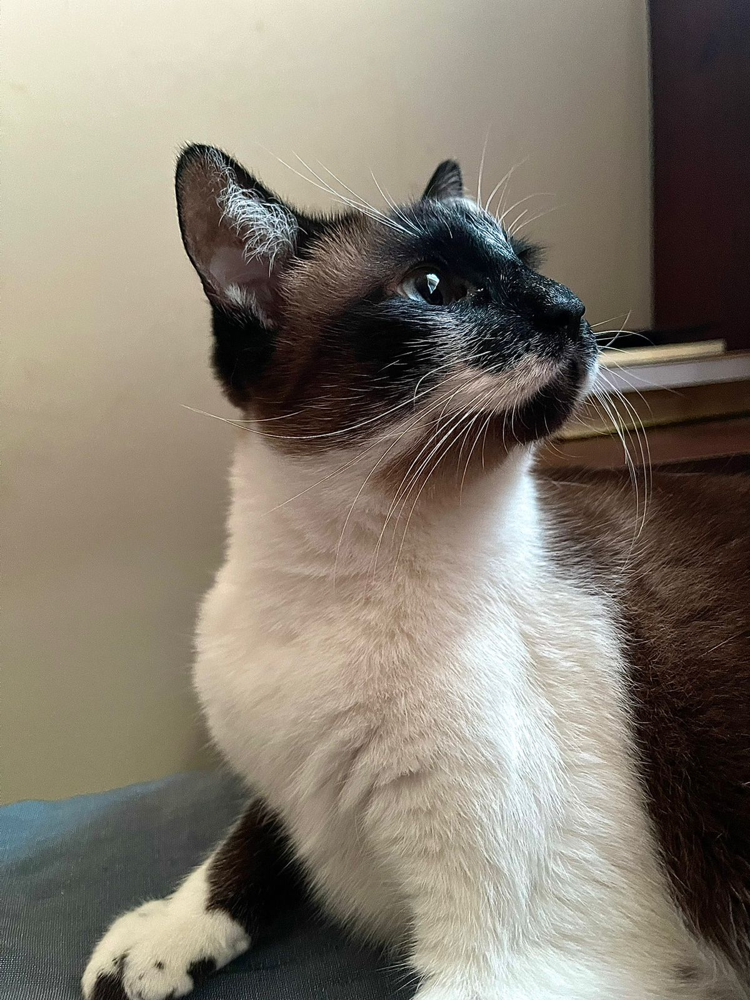
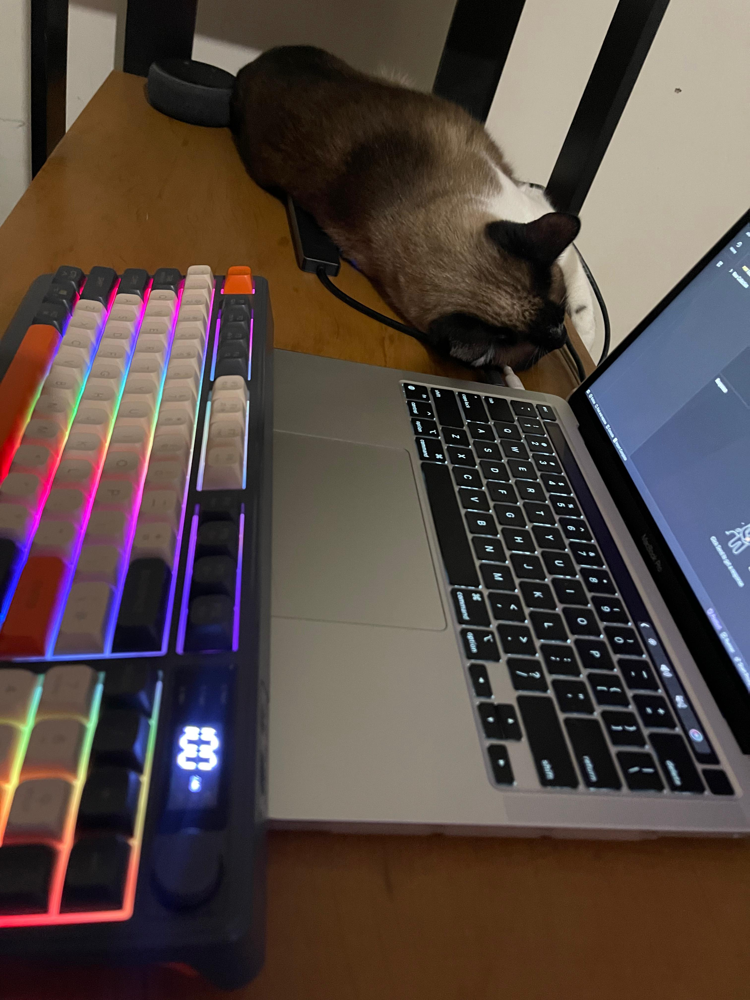

# Documentação da Fidelita API 🥳💜

## Introdução

A Fidelita API é uma aplicação desenvolvida como parte de um teste técnico para a empresa Fidelizi. O nome "Fidelita" é uma homenagem à minha fiel companheira de código, minha gata Lolita, que sempre esteve ao meu lado durante o desenvolvimento da aplicação.

## Objetivo da Aplicação:
A Fidelita API foi projetada para gerenciar e processar pontos de clientes, permitindo a acumulação e resgate de recompensas. A aplicação atende à problemática proposta pela Fidelize, que visa implementar um programa de fidelidade para seus clientes. O sistema permite que cada cliente ganhe 1 ponto a cada R$5,00 gastos e possibilita o resgate de prêmios com base no saldo de pontos acumulado.

## Arquitetura

A arquitetura da aplicação é baseada em Laravel, um framework PHP robusto e moderno que facilita o desenvolvimento de aplicações web seguras e escaláveis. A aplicação segue uma estrutura organizada, utilizando os melhores padrões de desenvolvimento para garantir um código limpo e fácil de manter.

### Componentes Principais

1. **Controladores (Controllers)**:
   - **CustomerController**: Gerencia o resgate de recompensas pelos clientes.
   - **PointController**: Gerencia a adição de pontos aos clientes com base em suas compras.
   - **RewardController**: Gerencia o resgate de recompensas pelos clientes.

2. **Serviços (Services)**:
   - **CustomerService**: Contém a lógica para retornar e criar dados de clientes.
   - **PointService**: Contém a lógica para calcular e processar pontos de clientes.
   - **RewardService**: Contém a lógica para resgatar recompensas e enviar notificações por e-mail.

3. **Modelos (Models)**:
   - **Customer**: Representa a tabela customer do banco, onde armazenam os clientes.
   - **Point**: Representa a tabela point, onde armazenam os pontos acumulados por um cliente.
   - **Purchase**: Representa a tabela purchase do banco, onde armazernam compras realizadas por um cliente.
   - **Reward**: Representa a tabela reward do banco de dados, onde armazenam as recompensas disponíveis para resgate.
   - **Redemption**: Representa a tabela redemption, onde armazenam os resgates de uma recompensa por um cliente.
   - **Token**: Representa a tabela token, onde armazenam os tokens de autenticação dos endpoints e suas devidas permissões.

4. **Jobs**:
   - **NotifyCustomerWithMaxPoints**: Envia um e-mail para clientes que possuem pontos suficientes para resgatar a recompensa máxima.

5. **Comandos Artisan**:
   - **DispatchNotifyCustomerWithMaxPoints**: Comando para notificar clientes sobre recompensas disponíveis quando atingem o máximo de pontos.

### Requisitos

- PHP 8.2
- Laravel 11
- MySQL 
- Composer

## Como Rodar a Aplicação

1. **Clone o Repositório**

   ```bash
   git clone https://github.com/vitorpedroso283/FIDELITA.git
   cd FIDELITA
   ```

2. **Instale as Dependências**

   Use o Composer para instalar as dependências do backend.

   ```bash
   composer install
   ```

3. **Configure o Ambiente**

   Renomeie o arquivo `.env.example` para `.env` e configure suas variáveis de ambiente, incluindo as configurações do banco de dados. Algumas configurações já foram definidas para facilitar o start do projeto.

   ```bash
   cp .env.example .env
   ```

   Edite o arquivo `.env` para incluir as credenciais do seu banco de dados e outras configurações necessárias.

4. **Gere a Chave de Aplicação**

   ```bash
   php artisan key:generate
   ```

5. **Execute as Migrações do Banco de Dados e os Seeders para popular as tabelas necessárias**

   ```bash
   php artisan migrate
   php artisan db:seed
   ```

6. **Inicie o Servidor**

   Para rodar o servidor de desenvolvimento, utilize o comando:

   ```bash
   php artisan serve
   ```

   A aplicação estará disponível em `http://localhost:8000.
   
   
7. **Importe a collection presente no repositório**
Existe um arquivo dentro do repositório chamado de  Customer.postman_collection.json. Esse é o arquivo json da collection Customer com os 6 Endpoints necessários da aplicação. Importe ele dentro do postman para testar a API.

## Considerações Finais

A Fidelita API foi projetada com os seguintes pontos em mente:

- **Autenticação**: Não foram utilizadas bibliotecas de autenticação padrão. Em vez disso, foram utilizados tokens fixos que foram fornecidos (dentro de uma tabela no BD) e um middleware personalizado foi criado para gerenciar a autenticação. Essa abordagem foi escolhida para simplificar o teste técnico, embora em um ambiente de produção eu utilizaria uma solução mais robusta como JWT ou OAuth para autenticação e autorização.
  
- **Processamento de Emails**: Os emails foram configurados para serem processados em segundo plano utilizando queues. No entanto, para a apresentação do teste, o driver `sync` foi utilizado como conexão para facilitar a utilização e garantir que os emails sejam enviados imediatamente.

- **Comandos Artisan para CronJobs:** Pensando em utilizar toda a estrutura do Laravel, foi criado um novo comando no arquivo console.php dentro de /routes/ para verificar os clientes com a pontuação suficiente para resgatar o prêmio máximo. Em ambiente de testes, usarei os comandos:
``` bash
php artisan schedule:list
php artisan schedule:run
php artisan schedule:work
```
    Obs: não instalei nenhum sistema de verificação de filas, como o horizon ou o supervisor, mas será possível ver a instalação bem sucedida do comando.

- **Princípios de Design**: A API segue os princípios de responsabilidade única, com métodos e classes bem definidos e com uma única responsabilidade. Os nomes dos métodos são projetados para refletir claramente suas funções, o que contribui para a limpeza e manutenção do código.
- **Uso de Services e ausência de Repositories:** Na nossa arquitetura, Services são usados para encapsular a lógica de negócios, enquanto os Controllers se concentram em receber e validar requisições, delegando a execução para os serviços. Optamos por não utilizar Repositories devido à simplicidade das operações de banco de dados, aproveitando a camada de abstração robusta oferecida pelo Eloquent ORM.

- **Documentação**: Comentários em PHPDoc foram utilizados para descrever as funções e métodos, proporcionando uma melhor compreensão do código e facilitando a manutenção.

Obrigado por utilizar a Fidelita API!

Espero que também apreciem a pequena obra de arte que é minha gatinha, sempre ao meu lado enquanto trabalho. Abaixo, ela exibe seu talento em posar e mostra como é minha fiel companheira. 😉



